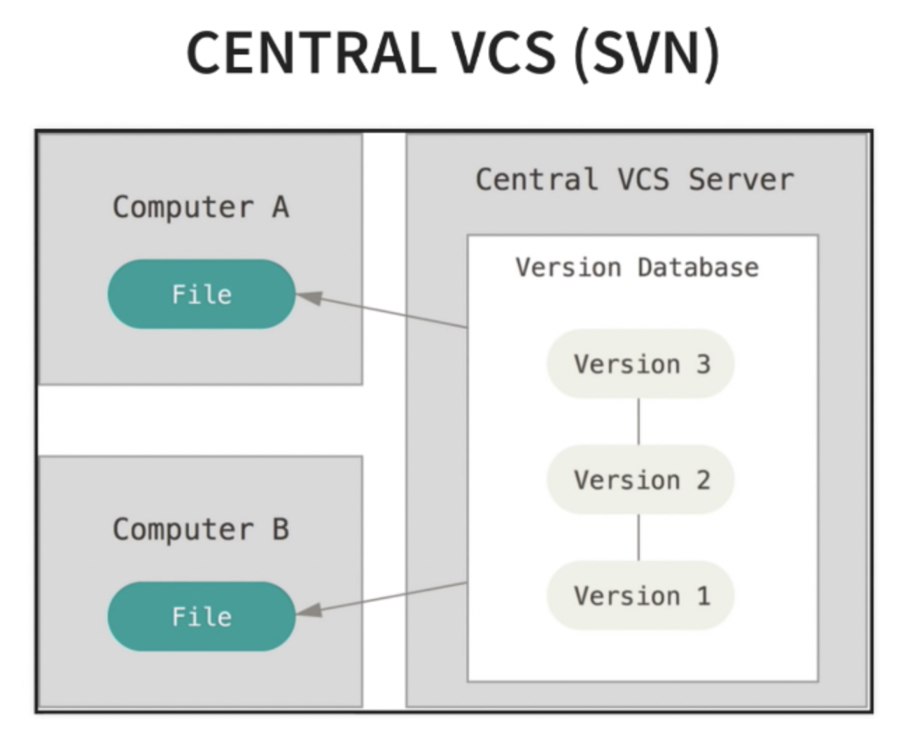
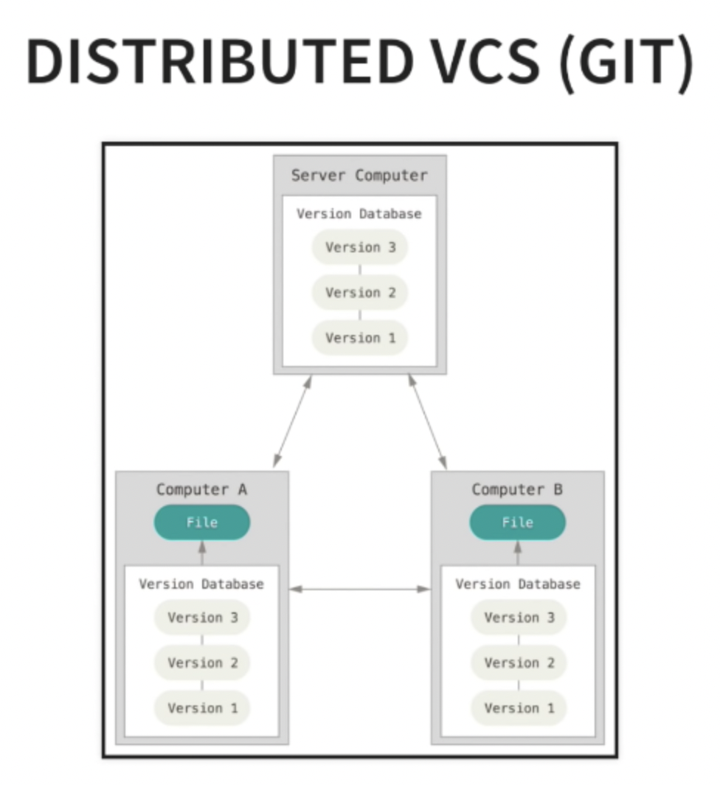
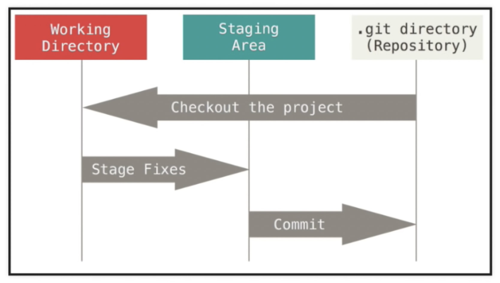

```
-Last updated 14-August-2023
```

# UVA Library Workshop on Introduction to Version Control and Git/Github


## About Me
* Erich Purpur: I am a Research Librarian for Science & Engineering in the Brown Science & Engineering Library. I've been at UVA since 2017.
* epurpur@virginia.edu

## Data Resources in the UVA Library
* [Research Data Services](https://data.library.virginia.edu/)
* [Workshop Series](https://data.library.virginia.edu/training/)

## Other Upcoming Workshops

| Workshop | Date | Time |
| ---- | ---- | ---- |
| Intro to Python pt 1                                                |       Tuesday 8/29   |  12:00 - 1:30pm
| Intro to Python pt 2                                                |       Tuesday 9/5    |  12:00 - 1:30pm
| Intro to Version Control w/ Git + Github                            |       Wednesday 9/6  |  1:00 - 2:30pm
| Python Data Analysis + Visualization                                |       Tuesdady 9/12  |  12:00 - 1:30pm
| Intro to Regular Expressions                                        |       Wednesday 9/13 |  1:00 - 2:30pm
| Python and APIs                                                     |       Tuesday 9/19   |  12:00 - 1:30pm
| Geospatial Data + Mapping in Python                                 |       Tuesday 9/26   |  12:00 - 1:30pm
| Python Web Dashboards w/ Streamlit                                  |       Tuesday 10/10  |  12:00 - 1:30pm

## Things to have before we begin

* Github account: https://github.com/
   - Create a free account if you don't have one yet
* A text editor or IDE. If you don't already have one, you can use something very simple like Notepad++: https://notepad-plus-plus.org/
   - R studio
   - Anaconda/Spyder
   - Visual Studio Code
   - Any plain text editor
* Git
   - For Windows: https://www.youtube.com/watch?v=albr1o7Z1nw (watch first 2:45)
   - For Mac: Git is usually installed by default but just in case: https://www.youtube.com/watch?v=sJ4zr0a4GAs


## First, our goals

1. Learn the background of version control
2. Feel comfortable with git/github workflows
3. Know how to get help


## What is Version Control?
Version control is the practice of tracking and managing changes to software code. Version control systems are software tools that help software teams manage changes to source code over time. Version control software keeps track of every modification to the code in a special kind of database. If a mistake is made, developers can turn back the clock and compare earlier versions of the code to help fix the mistake while minimizing disruption to all team members.


## A brief history of Version Control

* SVN (2000s) Centralized (client-server)
Centralized version control systems are based on the idea that there is a single “central” copy of your project somewhere (probably on a server), and programmers will “commit” their changes to this central copy. “Committing” a change simply means recording the change in the central system.


* git (2005) Distributed. Developed by [Linus Torvalds](https://en.wikipedia.org/wiki/Linus_Torvalds) for Linux development.
In software development, distributed version control is a form of version control in which the complete codebase, including its full history, is mirrored on every developer's computer.




### Why is it important?
There are many benefits but some of the key points are:
   * A single source of truth across teams, code, assets
   * Traceability for every change ever made
   * Speed of development. Many collaborators work on code together


## Some Terms

* git - version control software installed on your local machine
* GitHub - a for profit company owned by Microsoft. It provides cloud-based hosting of repositories.
* GitLab - an alternative to GitHub, not owned by Microsoft ([why you might want to switch](https://about.gitlab.com/2017/07/19/git-wars-switching-to-gitlab/)). "Free software deserves free tools."
* repository (repo) - Basic unit in git: a record of all changes to specified files.
* fork - personal copy of another users repo.
* branch - a parallel version of a repo (main branch is called "main", formerly "master").

[Github's Git Glossary](https://help.github.com/en/articles/github-glossary)

[Github's Git Handbook](https://guides.github.com/introduction/git-handbook/)


# Let's Get Started!

We will be using the git command line tool for this workshop. There are also GUI (graphical user interface) tools available, but version control is generally done at the command line. There is a limit to what the GUI tools can do and eventually you'll run into those barriers. Once you get used to it, the command line is the way to go.

If you are using Windows, open the git client. If you are on a Mac, open the terminal.

Let's see which version of git you have and also to check if it is installed.
```
git --version
```

### Set Config Values

This allows you to 
```
git config --global user.name "Your Name"
git config --global user.email "Your Email"

git config --list
```
Type "q" to exit.

## Two Common scenarios while using Git

### Scenario 1. Initialize a repository from existing code
This is the case that you have a local code base that you want to start tracking using git. So let's quickly create a few files. First, we will do a quick aside to learn how to navigate the file structure in the command line.

To see where you are in the file structure, type the following:
```
pwd
```

To see what files and folders this location contains...
```
ls
```

and to navigate to a file or folder do the following:
```
cd <directory name>
cd Desktop
```

a quick shortcut to navigate to the previous directory:
```
cd ..
```

```
# if you haven't yet you should probably navigate to a place you like to save temporary files/folders such as your desktop

mkdir testgit

cd testgit

touch testfile.txt

ls
```
Now, open up testfile.txt in any text editor and copy the following code into testfile.txt. This is python code, but you don't need to know python in order to follow this example.

```
def add_function(a, b):
    return a + b
    
def subtract_function(a, b):
   return a - b
```
Just to prove a point, make sure that you are inside the `testgit` directory (folder)

```
pwd
```

#### Track this code with git

```
git init

ls -la

#or 

ls -a
```
Because the .git directory is hidden, you need to use ```ls - la``` to see hidden files. The .git directory contains everything related to our repository. If you want to stop tracking this repo, you can just remove the .git directory as you would any other using ```rm -rf .git```


#### Our first Commit

Before we make a commit, let's check the status of the directory. You'll see which files are untracked in our directory.

```
git status
```



#### Add files to staging area

Add all the files
```
git add -A
```
or add them individually

```
git add testcode.py
git add `your file name here`
```

if you made a mistake, you can remove them from the staging area

```
git reset 'your file name here'
```

#### Commit the changes

When you make a commit, you want to write a descriptive message log. Not something generic like "made a bunch of changes". Be descriptive! If you need to look back in the commit logs for when you made an error, you will thank your former self that you left some clues about where to look. 
```
git commit -m "Message about changes here"
```

Let's look at the status again to make sure it worked.
```
git status
```

Or we can look at the commit we just made

```
git log
```

### Scenario 2: Track an Existing Remote project with Git
This is probably more likely how you will be using git in reality. Someone, or a group, has written some code that you want to download and use for yourself, make changes to, and develop over time. 

#### First, fork my repository
In the top right corner of the screen, click 'fork'. You'll make a copy of my <b><i> git intro </i></b> repository for yourself. We are doing this so that we are not all pushing changes to my remote repository at once, but instead to your own repository.

  If you are not a collaborator in a repo, you can't branch that repo. However, you can "fork" it, which is just creates a clone of the repo on the GitHub server.
  1. You can't push changes directly back to the original repo.
  2. You'll want to work on keeping your fork in sync with the project
      * add it to the original project as a remote, or
      * fetching regularly from the original repo
      

#### Clone a remote repository
This creates a clone of a remote repository, a .git directory is created to track changes.
```
git clone <url> <where to clone>
```
If you want to clone this github repo to your current working directory, use the following. Remember, this should be a URL to your own fork of the remote repository. Not mine!:
```
git clone https://github.com/epurpur/git-intro 
```
Navigate into the git-intro directory

```
cd git-intro
```

Check to see if this worked and view what is inside your current directory
```
ls -la
```

#### View information about the remote repository

List the information about the repository
```
git remote -v
```

List all of the branches in our repository (both locally and remote). We have not covered branches yet but we will very shortly!
```
git branch -a
```

#### Pushing Changes
Now that we have a cloned repository, we want to develop our code and make changes to it. 

#### Commit Changes

First, let's check the status of our code

```
git status
```
Now, make a change to the testcode.txt file. Let's add a new 'divide' function. Add the following code onto the end of the textcode.txt file.

```
def divide(a, b):
    return a / b
```

Let's see what the differences in the code is:
```
git diff
```

Next, make a commit LOCALLY. Remember, we this is just the file on our local computer and no changes have been made in the remote repository.
```
git add -A
git commit -m 'Added divide function'
```

#### Push changes to the remote repository

Remember, we are now working on a project that could potentially have multiple developers. People could have been working on different parts of the code at the same time we were doing our own work, so first you want to pull any changes from the main branch of the remote repository that have been made since the last time we pulled from that repository.

Origin is the name of the remote repository. Main is the name of the branch we are pushing to.
```
git pull origin main
```
Now let's push our changes to the remote repository.
```
git push origin main
```

## Branching

So far we have been working only on the main branch of our repository. But this really isn't how you should use version control and git in your day to day workflow. This is where branching comes in. 

A common workflow is to create a branch for your desired feature, then begin working off of that branch. 

#### Creating a branch

```
git branch calc-divide
```
Now let's see our local branches to make sure it worked correctly. You see the * next to main, indicating we are still working in the main branch, though we have created a new one called 'calc-divide'.
```
git branch
```
And now we move into our new branch. We must check out the branch in order to work in it.
```
git checkout calc-divide
```
and let's make sure we are now working in the 'calc-divide' branch. See the * has now moved to our new branch. 
```
git branch
```
If that is all correct, now we can work on our features. So let's make some changes to our code. Once we have done that let's push our changes to our local branch.
```
git status

git add -A

git commit -m "changed divide function"
```

#### Push branch to remote repository
```
git push -u origin calc-divide
```
The '-u' tells git we want to associate our local 'calc-divide' branch without remote 'calc-divide' branch. 
```
git branch -a
```
Now see all our branches, both local and remote, to see that we have now created and pushed our 'calc-divide' branch to our remote repository. 

We will now merge our 'calc-divide' branch with our main branch. 

#### Checkout our local main branch
First we want to do this merge locally before pushing it to the remote repository.
```
git checkout main
```
Pull any changes that have been made to the main branch while we have been working on our features.
```
git pull origin main
```
Merge the branch
```
git merge calc-divide
```
Check to see that we have merged the branch
```
git branch --merged
```
Now, push the local main branch to the remote main branch
```
git push origin main
```

#### Delete the Branch
Now that we have merged our branch, that feature is done and we can delete the branch. 

First, let's delete it locally
```
git branch -d calc-divide
```
Don't forget, this branch now also exists in the remote repository. 
```
git branch -a
```
You should see that we still have the 'calc-divide' branch in the remote repository. Now we will delete it from the remote repository.
```
git push origin --delete calc-divide
```

This seems like a lot of work but it becomes very fast once you begin to do it every day!


# Other Resources - Learn More!
There is a lot more you can do with git/GitHub. We just touched on basic workflow using the command line. There are a whole suite of tools available including using GitHub in the browser, downloading and installing a GUI version of GitHub to your desktop, automations, and so on. We can't possibly cover everything in one workshop but here are some other resources that you can look at if you are in need. 

### ChatGPT
    * ChapGPT has quickly made huge changes to the programming landscape. It is a hugely powerful tool **If you use it the right way!**. I think it is a somewhat slippery slope of how to advise new programmers to use ChatGPT (or other AI tools) so I will refer to some best practices. My personal opinion is that you should use AI minimally when you are starting. When you have a better grasp of basic fundamentals, then you can include AI and greatly increase your speed. **Never accept ChatGPT code verbatim!** Always double check it before including it in your workflows.
    * [How to Effectively Learn to Program w/ ChatGPT](https://towardsdatascience.com/how-to-effectively-start-coding-in-the-era-of-chatgpt-cfc5151e1c42)
    * [Corey Schafer's "How to use ChatGPT"](https://www.youtube.com/watch?v=jRAAaDll34Q)

### Corey Schafer Youtube
Corey Schafer is just a guy with a YouTube page. However, when I am learning a new programming skill, tool, library, or concept, I first go to his page to see if he has done a tutorial and he usually has! When I was first learning Git/Github workflow, I constantly referred to his walkthrough video. [Here is a link](https://www.youtube.com/watch?v=HVsySz-h9r4). In fact, when I was preparing this tutorial I basically copied his video as I found it very easy to follow and did not think I could do it any better.

### StackOverflow
If you are not familiar with [StackOverflow](https://stackoverflow.com/) yet, you probably will be very soon. StackOverflow is basically a community question/answer site with users worldwide. You can ask technology specific questions and get an answer from a knowledgeable person and probably very quickly. If you google your question such as: "How to delete a branch github", odds are high one of the first results will be a StackOverflow thread. If you are a beginner in some concept, be sure to look for an answer first before asking a new question on StackOverflow. 

### GitHub Flow
[https://guides.github.com/introduction/flow/](https://guides.github.com/introduction/flow/)

### Additional Items
  * Command Line Interface (CLI) [cheat sheet](https://education.github.com/git-cheat-sheet-education.pdf)
  * [Create your own Webpage](https://pages.github.com/) (such as https://rjp0i.github.io/intro.html)
